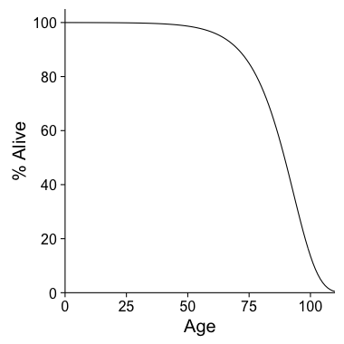

# Simulation of the global human population under different reproductive scenarios

## Methods

Mortality is based on a Gompertz-function $e^{-0.003 * e^{\dfrac{Age - 35}{10}}}$.

Fecundity is based on the function of [@Leridon2004].

## Results

