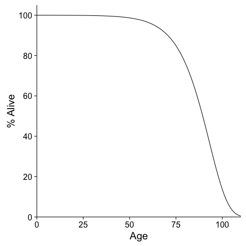
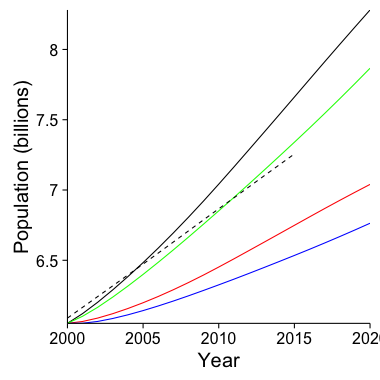

Simulation of the global human population under different reproductive scenarios
================================================================================

Methods
-------

Mortality is based on a Gompertz-function $e^{-0.003 * e^{{10}}}$.

Results
-------

